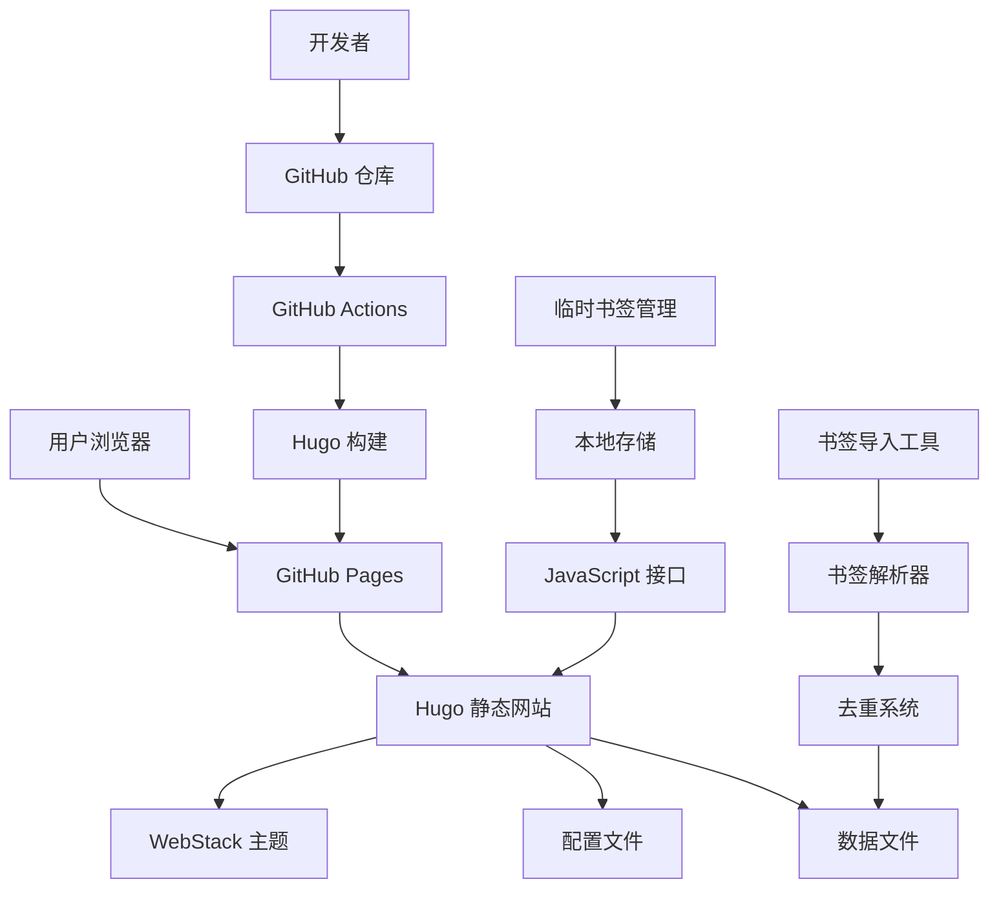

# 设计文档

## 概述

本设计文档描述了基于 WebStack-Hugo 主题的自定义导航网站的技术架构和实现方案。该网站将提供个性化的书签导航功能，支持浏览器书签导入、临时工作书签管理，并通过 GitHub Pages 自动部署。

## 架构

### 系统架构图



### 技术栈

- **前端框架**: Hugo 静态网站生成器
- **主题**: WebStack-Hugo (基于 Bootstrap)
- **部署平台**: GitHub Pages
- **CI/CD**: GitHub Actions
- **配置格式**: TOML (Hugo 配置) + YAML (数据文件)
- **书签解析**: Python/Node.js 脚本
- **临时存储**: 浏览器 LocalStorage
- **图标管理**: 本地资源 + Favicon API

## 组件和接口

### 1. 核心组件

#### 1.1 Hugo 网站生成器
- **职责**: 将配置和数据文件编译为静态 HTML
- **输入**: config.toml, data/webstack.yml, 主题文件
- **输出**: public/ 目录下的静态网站文件

#### 1.2 WebStack 主题
- **职责**: 提供响应式布局和交互功能
- **功能**: 分类展示、搜索过滤、响应式设计
- **自定义**: 支持主题配置和样式覆盖

#### 1.3 书签解析器
- **职责**: 解析浏览器导出的书签文件
- **支持格式**: Chrome HTML, Firefox HTML, Safari plist
- **输出**: 标准化的 YAML 数据结构

#### 1.4 去重系统
- **职责**: 检测和处理重复的 URL
- **算法**: URL 标准化 + 域名匹配
- **策略**: 保留最新条目，合并描述信息

#### 1.5 临时书签管理器
- **职责**: 管理临时工作书签的增删改查
- **存储**: 浏览器 LocalStorage
- **同步**: 可选的 GitHub 仓库同步

### 2. 数据模型

#### 2.1 导航链接数据结构
```yaml
- taxonomy: 分类名称
  icon: FontAwesome 图标类名
  links:
    - title: 网站标题
      logo: 图标文件名
      url: 网站URL
      description: 网站描述
      qrcode: 二维码图片 (可选)
  list:
    - term: 子分类名称
      links: [链接数组]
```

#### 2.2 临时书签数据结构
```javascript
{
  "temporaryBookmarks": [
    {
      "id": "unique-id",
      "title": "网站标题",
      "url": "网站URL",
      "description": "描述",
      "addedAt": "2024-01-01T00:00:00Z",
      "category": "临时分类"
    }
  ]
}
```

#### 2.3 配置文件结构
```toml
baseURL = "https://username.github.io/repo-name/"
title = "我的导航网站"
theme = "WebStack-Hugo"

[params]
    author = "作者名称"
    description = "网站描述"
    logosPath = "assets/images/logos"
    defaultLogo = "assets/images/logos/default.webp"
    enablePreLoad = true
    expandSidebar = false
    nightMode = false
```

### 3. 接口设计

#### 3.1 书签导入 API
```python
class BookmarkParser:
    def parse_html_bookmarks(self, file_path: str) -> List[Bookmark]:
        """解析 HTML 格式的书签文件"""
        pass
    
    def parse_safari_plist(self, file_path: str) -> List[Bookmark]:
        """解析 Safari plist 格式的书签文件"""
        pass
    
    def deduplicate_bookmarks(self, bookmarks: List[Bookmark]) -> List[Bookmark]:
        """去除重复的书签"""
        pass
    
    def convert_to_yaml(self, bookmarks: List[Bookmark]) -> str:
        """转换为 YAML 格式"""
        pass
```

#### 3.2 临时书签 JavaScript API
```javascript
class TemporaryBookmarkManager {
    addBookmark(bookmark) {
        // 添加临时书签到 LocalStorage
    }
    
    removeBookmark(id) {
        // 删除指定的临时书签
    }
    
    moveToCategory(id, category) {
        // 将临时书签移动到永久分类
    }
    
    clearAll() {
        // 清空所有临时书签
    }
    
    syncToGitHub() {
        // 同步到 GitHub 仓库 (可选功能)
    }
}
```

#### 3.3 图标管理 API
```javascript
class IconManager {
    async fetchFavicon(url) {
        // 获取网站的 favicon
        const faviconUrl = `https://www.google.com/s2/favicons?domain=${domain}`;
        return faviconUrl;
    }
    
    getDefaultIcon() {
        // 返回默认图标路径
        return 'assets/images/logos/default.webp';
    }
    
    saveIcon(url, iconData) {
        // 保存图标到本地资源目录
    }
}
```

## 数据模型

### 1. 网站配置模型
```yaml
Site:
  baseURL: string
  title: string
  author: string
  description: string
  theme: string
  params:
    logosPath: string
    defaultLogo: string
    enablePreLoad: boolean
    expandSidebar: boolean
    nightMode: boolean
```

### 2. 导航数据模型
```yaml
NavigationCategory:
  taxonomy: string
  icon: string
  links?: Link[]
  list?: SubCategory[]

SubCategory:
  term: string
  links: Link[]

Link:
  title: string
  logo: string
  url: string
  description: string
  qrcode?: string
```

### 3. 临时书签模型
```yaml
TemporaryBookmark:
  id: string
  title: string
  url: string
  description: string
  addedAt: datetime
  category: string
  favicon?: string
```

### 4. 书签导入模型
```yaml
ImportedBookmark:
  title: string
  url: string
  folder: string
  addDate: datetime
  icon?: string
  description?: string
```

## 正确性属性

*属性是一个特征或行为，应该在系统的所有有效执行中保持为真——本质上是关于系统应该做什么的正式声明。属性作为人类可读规范和机器可验证正确性保证之间的桥梁。*

### 属性 1: 配置应用一致性
*对于任何*有效的配置文件，Hugo 构建过程应该生成包含所有配置设置的静态网站，包括自定义标题、分类和链接数据
**验证需求: 需求 1.1, 1.5, 4.1, 4.2**

### 属性 2: 链接渲染完整性
*对于任何*导航链接数据，渲染的 HTML 应该包含标题、描述、URL 和图标信息，并且链接应该设置为在新标签页中打开
**验证需求: 需求 1.2, 3.3, 3.5**

### 属性 3: 图标管理一致性
*对于任何*链接，如果指定的图标文件存在则显示该图标，如果不存在则显示默认图标或自动获取的 favicon
**验证需求: 需求 1.3, 4.3, 8.5**

### 属性 4: 分类结构保持性
*对于任何*包含子分类的导航数据，渲染的网站应该正确显示分类层次结构，并且分类数量应该符合最小要求
**验证需求: 需求 3.1, 3.2**

### 属性 5: Hugo 构建确定性
*对于任何*有效的配置和数据文件，Hugo 构建过程应该在指定的输出目录中生成完整的静态网站文件
**验证需求: 需求 2.3**

### 属性 6: 错误处理一致性
*对于任何*无效的配置文件或数据文件，系统应该产生清晰的错误消息而不是静默失败
**验证需求: 需求 4.5, 8.7**

### 属性 7: 搜索功能正确性
*对于任何*搜索查询和链接数据集，搜索结果应该只包含标题或描述中包含查询词的链接，并且匹配的术语应该被高亮显示
**验证需求: 需求 6.1, 6.2**

### 属性 8: 临时书签管理一致性
*对于任何*临时书签操作（添加、删除、清空），本地存储应该正确反映操作结果，并且操作应该是可逆的
**验证需求: 需求 7.2, 7.3, 7.4**

### 属性 9: 书签解析准确性
*对于任何*有效的浏览器书签文件，解析器应该提取所有书签的标题、URL 和文件夹信息，并且输出格式应该与系统数据模型兼容
**验证需求: 需求 8.1, 8.2**

### 属性 10: 去重算法正确性
*对于任何*包含重复 URL 的书签集合，去重系统应该保留最新的条目并移除重复项，同时保持数据完整性
**验证需求: 需求 8.3**

### 属性 11: 分类映射一致性
*对于任何*具有文件夹结构的导入书签，系统应该将文件夹正确映射到相应的导航分类，保持层次关系
**验证需求: 需求 8.4**

### 属性 12: 多格式支持兼容性
*对于任何*支持的浏览器书签格式（Chrome HTML、Firefox HTML、Safari plist），解析器应该能够正确解析并产生一致的输出结构
**验证需求: 需求 8.6**

### 属性 13: 懒加载属性正确性
*对于任何*生成的图像标签，如果启用了懒加载功能，则应该包含适当的懒加载属性
**验证需求: 需求 5.3**

## 错误处理

### 1. 配置文件错误
- **无效的 TOML 语法**: 提供详细的语法错误位置和建议
- **缺失必需字段**: 列出所有缺失的必需配置项
- **无效的配置值**: 验证配置值的类型和范围

### 2. 数据文件错误
- **无效的 YAML 语法**: 提供语法错误的行号和列号
- **缺失必需字段**: 验证链接数据的完整性
- **无效的 URL 格式**: 验证 URL 的有效性

### 3. 资源文件错误
- **缺失的图标文件**: 自动回退到默认图标
- **无效的图像格式**: 提供支持格式的列表
- **资源路径错误**: 验证资源文件的存在性

### 4. 书签导入错误
- **不支持的文件格式**: 提供支持格式的列表和转换建议
- **文件解析失败**: 提供详细的错误信息和可能的解决方案
- **数据转换错误**: 记录无法转换的条目并继续处理其他条目

### 5. 临时书签错误
- **本地存储不可用**: 提供替代的存储方案或降级功能
- **数据同步失败**: 提供离线模式和手动同步选项
- **存储空间不足**: 提供清理建议和存储使用情况

## 测试策略

### 双重测试方法
本项目将采用单元测试和基于属性的测试相结合的方法：

- **单元测试**: 验证特定示例、边界情况和错误条件
- **属性测试**: 验证所有输入的通用属性
- 两者互补，提供全面的覆盖范围

### 单元测试重点
单元测试将专注于：
- 特定的配置示例和数据格式
- 边界情况（空文件、最大大小限制）
- 错误条件（无效格式、网络失败）
- 组件之间的集成点

### 基于属性的测试配置
- **测试库**: 使用 Hypothesis (Python) 或 fast-check (JavaScript)
- **最小迭代次数**: 每个属性测试至少 100 次迭代
- **测试标记格式**: **功能: custom-navigation-website, 属性 {编号}: {属性文本}**
- 每个正确性属性必须由单个基于属性的测试实现

### 测试数据生成策略
- **配置文件生成器**: 生成有效和无效的 TOML 配置
- **书签数据生成器**: 生成各种格式的书签文件
- **URL 生成器**: 生成有效和无效的 URL
- **HTML 生成器**: 生成用于解析测试的 HTML 结构

### 性能测试
- **构建时间测试**: 验证大型数据集的构建性能
- **内存使用测试**: 监控解析大型书签文件时的内存消耗
- **并发测试**: 测试多个用户同时访问临时书签功能